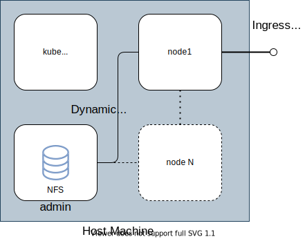

# Kubernetes Vagrant

This repository code allows you to create a single master kubernetes cluster with any number of worker nodes.
Its a single command Vagrant up to setup full kubernetes play environment in a laptop.

Kubernetes Version `1.22.3`

## Pre-Requisites

- [Vagrant](https://www.vagrantup.com/docs/installation)
- [VirtualBox](https://www.virtualbox.org/manual/ch02.html) 7.x


## Configure VMs

Cluster must have at least admin, master and node1 VMs. These VMs resources can be updated based on CPU and memory
available on host machine. All VM configurations are performed on [Vagrant](Vagrant) file. Common CPU and memory 
configuration defined at the top of the file with following config. These setting would be good minimum for a working
cluster and this is applied for both admin and master VMs.
```shell
  config.vm.provider :virtualbox do |v|
    v.memory = 2096
    v.cpus = 2
  end
```

Node VMs resource can be configured separately towards the bottom of the file with following config. Nodes need to have
more resources as they run the workloads.
```shell
      node.vm.provider :virtualbox do |v|
        v.name = name
        v.memory = 4096
        v.cpus = 2
      end
```

Number of worker nodes to be in the cluster can be configured as follows. For example three worker nodes cluster is
setup by having `%w{node1 node2 node3}`. Keep the VM names node[1..N]. All nodes configured with same resource
configuration.
```shell
  %w{node1 node2 node3}.each_with_index do |name, i|
  .
  .
  end
```

## Cluster Architecture

Following diagram shows high level architecture. VM node1 port forward port 30443 which allows accessing any workloads
via ingress controller.



## Cluster Start

Solution is designed to start the cluster from scratch. If any problems occurs it is best to destroy the cluster and
re-provision again. All vagrant commands are run from the repository root where [Vagrantfile](Vagrantfile) file present.

```shell
# Create Kube Cluster
vagrant up

# Destroy kube cluster
vagrant destroy -f

# SSH into a VM
vagrant ssh master/admin/node1
```

## Calico CNI Manifest Template

Calico CNI default manifest does not work directly on this cluster due to VM having multiple network interfaces.
Default manifest need to be updated with `IP_AUTODETECTION_METHOD` and environment variable as per below example.
```yaml
  # Auto-detect the BGP IP address.
  - name: IP
    value: "autodetect"
  - name: IP_AUTODETECTION_METHOD
    value: "interface=${VM_CLUSTER_NIC_ID}"
```

## FluxCD v2 Installation

FluxCD is used for deploying applications in GitOps way. FluxCD v2 need to be bootstrapped for this purpose. FluxCD used
along with Kustomization to customise the deployment for environments. This repository only supports one environment
and it is called `dev`. All the flux managed resources are configured in folder `flux`

- Create a personal access token for the Github user account via user settings -> developer settings -> personal access tokens
  Provide full access to repo.
- export the environment variables GITHUB_USER, GITHUB_REPO and GITHUB_TOKEN

During the Flux bootstrap, repo will be updated and added Flux related resources to the folder  flux/clusters/dev/flux-system
These resources manage the flux itself in GitOps way

```shell
# Commands will be run inside the master VM as vagrant user
vagrant ssh master

# Export github values
export GITHUB_TOKEN=<personal access token>
export GITHUB_USER=<github username>
export GITHUB_REPO=kubernetes-playground

# If FluxCD must poll different branch export the branch name
export GITHUB_BRANCH=dev

# Run bootstrap script
/vagrant/scripts/install-flux2
```

Please refer to [docs/fluxcd.md](docs/fluxcd.md) for more details.

## Configure Kubectl on Host Machine

Vagrant up command copy kube config file to /root/.kube/config folder on master. This requires user to ssh into master VM
to execute any kubectl commands. Host machine can be setup to access the cluster via kubectl with following steps. Host 
machine need to have [kubectl](https://kubernetes.io/docs/tasks/tools/install-kubectl/) install. Virtual machines use
host-only network adapter and that allows accessing the virtual machine directly from host machine.

```shell
# SSH into master VM
vagrant ssh master

# Copy the content of the kube config file
sudo cat /root/.kube/config

# Create kube config file content from master to host.
mkdir ~/.kube && chmod 700 ~/.kube
vi ~/.kube/config
chmod 700 ~/.kube/config

# Verify cluster 
kubectl config get-contexts
```

## Dynamic NFS PV Storage

Dynamic NFS pv provisioning help creating PVs dynamically when a PVC is created. All PVs are created on NFS server
and PVC must add a annotation to indicate the storage class. Following example shows how to create PVC using
the dynamic nfs PV provisioning.

On the master node as root create file `/tmp/my-pvc.yaml` with content:
```yaml
kind: PersistentVolumeClaim
apiVersion: v1
metadata:
  name: my-pvc
  annotations:
    volume.beta.kubernetes.io/storage-class: "nfs-storage"
spec:
  accessModes:
    - ReadWriteOnce
  resources:
    requests:
      storage: 1Mi
```

On the master node as root run `kubectl apply -f /tmp/my-pvc.yaml` to create the pvc.
Check the pvc is created and bound with command `kubectl get pvc`. Check on admin VM at /nfs
new folder created for the PV.
